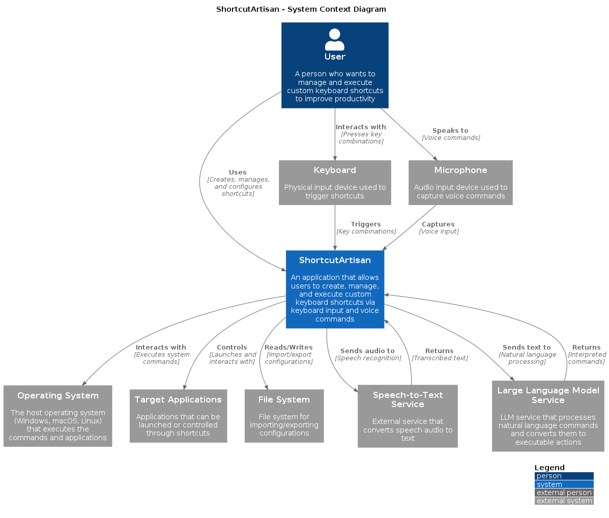

# ShortcutArtisan ⌨️ + 🛠️

ShortcutArtisan is an application for creating and managing custom keyboard shortcuts. Boost your productivity by tailoring shortcuts to fit your workflow with ease!

## 🛠️ Technologies & Tools

### 🖥️ Frontend

- **Framework**: [Next.js](https://nextjs.org/) (v15)
- **Styling**: [TailwindCSS](https://tailwindcss.com/) with shadcn/ui components
- **State Management** [Redux Toolkit](https://redux-toolkit.js.org/)

### ⚙️ Backend

- **Framework**: [Tauri](https://tauri.app/) (v2) - Rust-based desktop application framework
- **Rust Dependencies**:
  - Tokio - Asynchronous runtime
  - Serde - Serialization/deserialization
  - UUID - Unique identifier generation

## ✅ Prerequisites

Before running the application, ensure you have the following installed:

- [Node.js](https://nodejs.org/) (LTS version recommended) 📦
- [Rust](https://www.rust-lang.org/tools/install) toolchain 🦀
- Platform-specific dependencies for Tauri (see [Tauri prerequisites](https://v2.tauri.app/start/prerequisites/)) 🔍
- [Docker](https://www.docker.com/) - For AI services (Ollama LLM) 🐳

## 🚀 Getting Started

1. **Install dependencies** 📥:

```bash
npm install
```

2. **Run in development mode** 🏃‍♂️:

```bash
npm run tauri dev
```

This will start both the Next.js frontend and the Tauri backend.

3. **Build for production** 📦:

```bash
npm run tauri build
```

## 🤖 AI Services Setup

ShortcutArtisan uses local AI models for voice command processing:

1. **Start Ollama service** 🚀:

```bash
cd docker
docker compose up -d
```

2. **Pull the Llama model** (first time only) 📥:

```bash
docker compose exec ollama ollama pull llama3.2:3b
```

3. **Verify the setup** ✅:

```bash
curl http://localhost:11500/api/tags
```

4. **Stop AI services** 🛑:

```bash
docker-compose down
```

**Note**: The Llama 3.2:3b model is ~2GB. Ensure you have sufficient disk space and internet bandwidth for the initial download.

## 📂 Project Structure

This will create executable installers in the `src-tauri/target/release` directory.

## 📂 Project Structure

- `src/` - Next.js frontend code 🖥️
- `src-tauri/` - Tauri/Rust backend code ⚙️
- `docs/` - Project documentation 📝

### 🚧 Application is under construction 👷‍♀️🚧

## 💻 Compatibility

ShortcutArtisan currently has the following operating system compatibility:

| Operating System | Status           | Notes                                                  |
| ---------------- | ---------------- | ------------------------------------------------------ |
| macOS            | ❌ Not supported | Support planned for future releases                    |
| Windows          | ❌ Not supported | Support planned for future releases                    |
| Linux            | 🧪 Experimental  | May have limited functionality and unexpected behavior |

## 📊 System Architecture

Below is a system context diagram showing the high-level architecture of ShortcutArtisan:

<div align="center">
  
</div>

The diagram illustrates how ShortcutArtisan interacts with:

- The user who creates and manages shortcuts 👤
- The operating system to execute commands 💻
- The speech-to-text service to convert voice commands to text 🔊
- The large language model service to process natural language commands to executable actions 🤖
- Target applications that can be controlled 🎯
- The file system for configuration import/export 📁
- The keyboard as the physical input device ⌨️

This architecture enables ShortcutArtisan to serve as a central hub for productivity enhancement through custom keyboard shortcuts. ⚡
