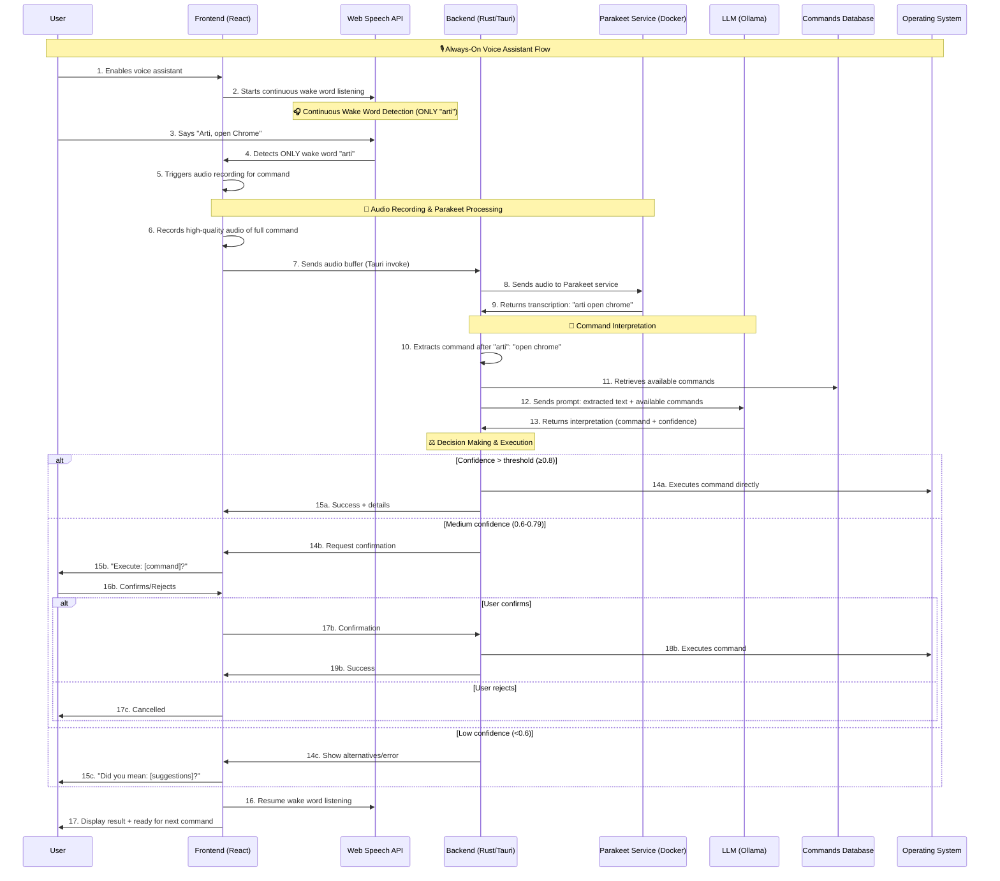
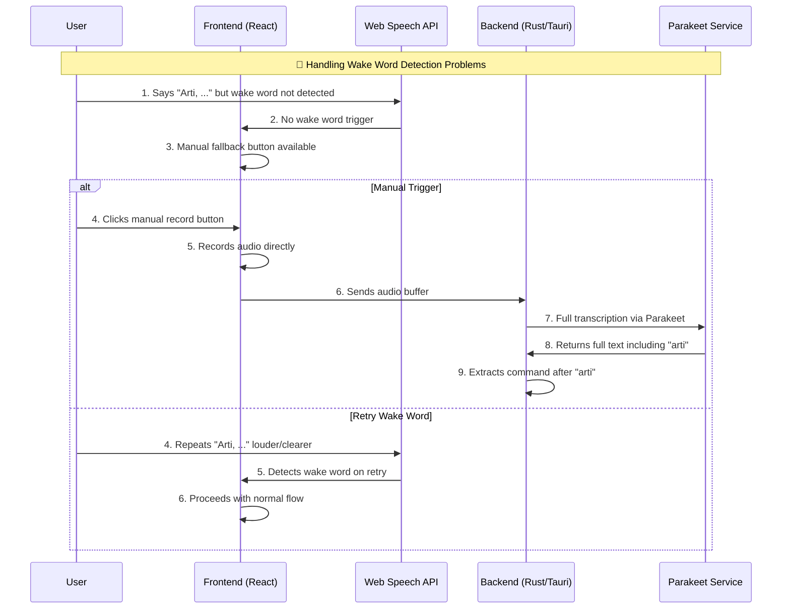

# Voice Command Processing Flow

## Overview

This document describes the complete end-to-end flow for processing voice commands in ShortcutArtisan. The system enables users to execute custom keyboard shortcuts using natural language voice commands, providing an intuitive and hands-free way to interact with the application. The system uses a hybrid approach with Web Speech API for wake word detection and Parakeet for high-quality command transcription.

## Architecture Components

### Frontend (React/Next.js)

- **Wake Word Detection**: Web Speech API for continuous "arti" wake word listening
- **Voice Processing**: Hybrid approach combining browser and local AI services
- **User Interface**: Always-on listening indicators, command feedback, status display
- **State Management**: Redux Toolkit for voice command and assistant state

### Backend (Rust/Tauri)

- **Command Processing**: Text-based command interpretation from Web Speech API
- **AI Service Coordination**: Integration with local Parakeet service for enhanced transcription
- **Command Interpretation**: Integration with LLM for natural language understanding
- **Execution Engine**: Decision making and command execution logic
- **Database Integration**: Access to shortcuts and commands database

### AI Services

- **Web Speech API**: Browser-native wake word detection ONLY (trigger for "arti")
- **Parakeet TDT 0.6B v3**: Primary speech-to-text engine for all command processing
- **Ollama (LLM)**: Local Llama 3.2:3b model for command interpretation
- **Docker**: Containerized AI services for consistent deployment

## Complete Flow Diagram

### Primary Flow: Wake Word Trigger + Parakeet Processing

### Error Handling Flow: Wake Word Detection Issues

## Detailed Process Steps

### Phase 1: Always-On Wake Word Detection (Web Speech API ONLY)

1. **Assistant Activation**: User enables voice assistant in UI
2. **Microphone Access**: Frontend requests persistent microphone permissions
3. **Web Speech API Setup**: Configure continuous speech recognition with:
   - Language: English (en-US)
   - Continuous mode: true
   - Interim results: true
   - **Purpose**: ONLY detect wake word "arti" - NO command processing
4. **Continuous Listening**: Browser continuously monitors ONLY for wake word "arti"
5. **Wake Word Trigger**: When "arti" detected, immediately start audio recording

### Phase 2: Command Audio Recording & Parakeet Processing

#### Audio Recording Trigger

1. **Wake Word Detected**: Web Speech API detects "arti" keyword
2. **Recording Start**: Frontend immediately starts high-quality audio recording
3. **Recording Duration**: Record for 3-5 seconds after wake word detection
4. **Audio Buffer**: Capture complete command including "arti" prefix

#### Parakeet Processing (PRIMARY & ONLY transcription method)

1. **Audio Transmission**: Send complete audio buffer to backend
2. **Parakeet Service**: Backend forwards audio to local Parakeet service
3. **Full Transcription**: Parakeet processes entire audio including "arti"
4. **Enhanced Results**: Receive high-quality transcription with:
   - Automatic punctuation and capitalization
   - Word-level timestamps
   - Multilingual support (25 languages)
   - Superior noise robustness
5. **Command Extraction**: Backend extracts command text after "arti" keyword

### Phase 3: Command Interpretation

1. **Context Gathering**: System retrieves all available shortcuts from database
2. **Prompt Construction**: Creates structured prompt with:
   - User's transcribed text (ALWAYS from Parakeet - never Web Speech API)
   - Available commands and their descriptions
   - Context about command categories
   - Previous command history (optional)
3. **LLM Processing**: Ollama processes the prompt using Llama 3.2:3b
4. **Response Parsing**: LLM response parsed for:
   - Best matching command ID
   - Confidence score (0.0-1.0)
   - Reasoning explanation
   - Alternative suggestions

### Phase 4: Intelligent Decision Making & Execution

1. **Confidence Evaluation**: System evaluates LLM confidence score
2. **Smart Decision Tree**:
   - **High Confidence (≥0.8)**: Immediate execution with notification
   - **Medium Confidence (0.6-0.79)**: Request user confirmation with preview
   - **Low Confidence (<0.6)**: Show alternatives or suggest retry
3. **Command Execution**: If approved, execute through existing shortcut system
4. **User Feedback**: Provide clear feedback on execution result
5. **Return to Listening**: Automatically resume wake word detection

### Phase 5: Continuous Operation

1. **State Management**: Maintain assistant state across sessions
2. **Error Handling**: Graceful recovery from speech recognition errors
3. **Performance Monitoring**: Track recognition accuracy and response times
4. **Adaptive Learning**: Optionally improve recognition based on user corrections
