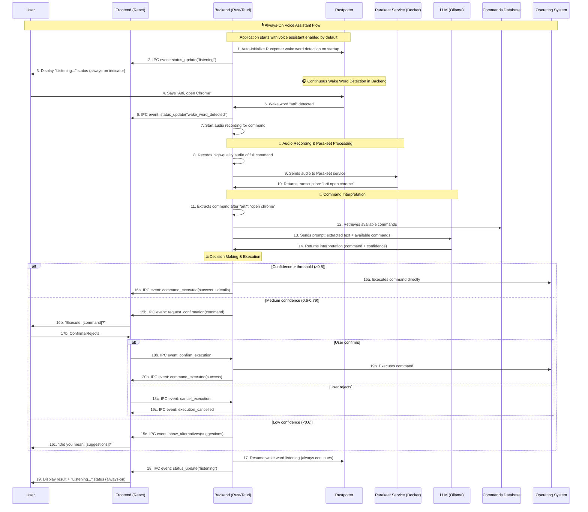
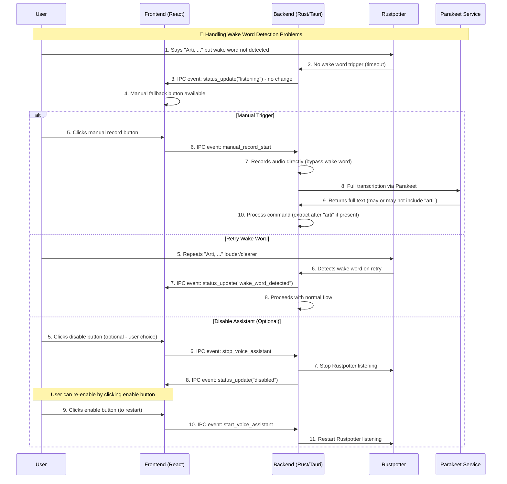

# Voice Command Processing Flow

## Overview

This document describes the complete end-to-end flow for processing voice commands in ShortcutArtisan. The system enables users to execute custom keyboard shortcuts using natural language voice commands, providing an intuitive and hands-free way to interact with the application. The system uses Rustpotter for wake word detection in the backend and Parakeet for high-quality command transcription.

## Architecture Components

### Frontend (React/Next.js)

- **Status Display**: Shows listening status ("listening"/"disabled"/"wake word detected")
- **User Controls**: Disable button to turn off voice assistant (listening is always-on by default)
- **Command Feedback**: Display command execution results and confirmations
- **State Management**: Redux Toolkit for voice assistant UI state and status

### Backend (Rust/Tauri)

- **Wake Word Detection**: Rustpotter integration for continuous "arti" wake word listening
- **Audio Recording**: Triggered audio capture after wake word detection
- **AI Service Coordination**: Integration with local Parakeet service for enhanced transcription
- **Command Interpretation**: Integration with LLM for natural language understanding
- **Execution Engine**: Decision making and command execution logic
- **Database Integration**: Access to shortcuts and commands database
- **IPC Communication**: Events to frontend for status updates and user interactions

### AI Services

- **Rustpotter**: Rust-based wake word detection library for "arti" keyword spotting
- **Parakeet TDT 0.6B v3**: Primary speech-to-text engine for all command processing
- **Ollama (LLM)**: Local Llama 3.2:3b model for command interpretation
- **Docker**: Containerized AI services for consistent deployment

## Complete Flow Diagram

### Primary Flow: Rustpotter Wake Word Detection + Parakeet Processing

### Error Handling Flow: Wake Word Detection Issues

## Detailed Process Steps

### Phase 1: Always-On Wake Word Detection (Rustpotter)

1. **Automatic Startup**: Voice assistant starts automatically when application launches
2. **Rustpotter Auto-Initialization**: Backend automatically initializes Rustpotter with:
   - Wake word: "arti"
   - Audio format configuration (sample rate, channels)
   - Detection threshold and sensitivity settings
   - Microphone access through system audio APIs
3. **Status Update**: Backend sends `status_update("listening")` IPC event to frontend
4. **Always-On Listening**: Rustpotter continuously monitors audio stream for "arti" wake word
5. **User Control**: User can optionally disable listening via UI button (sends `stop_voice_assistant`)
6. **Wake Word Trigger**: When "arti" detected, Rustpotter notifies backend to start command recording

### Phase 2: Command Audio Recording & Parakeet Processing

#### Audio Recording Trigger

1. **Wake Word Detected**: Rustpotter detects "arti" keyword in backend
2. **Status Notification**: Backend sends `status_update("wake_word_detected")` to frontend
3. **Recording Start**: Backend immediately starts high-quality audio recording
4. **Recording Duration**: Record for 3-5 seconds after wake word detection
5. **Audio Buffer**: Capture complete command including "arti" prefix

#### Parakeet Processing (PRIMARY & ONLY transcription method)

1. **Audio Processing**: Backend processes recorded audio buffer internally
2. **Parakeet Service**: Backend forwards audio to local Parakeet service
3. **Full Transcription**: Parakeet processes entire audio including "arti"
4. **Enhanced Results**: Receive high-quality transcription with:
   - Automatic punctuation and capitalization
   - Word-level timestamps
   - Multilingual support (25 languages)
   - Superior noise robustness
5. **Command Extraction**: Backend extracts command text after "arti" keyword

### Phase 3: Command Interpretation

1. **Context Gathering**: System retrieves all available shortcuts from database
2. **Prompt Construction**: Creates structured prompt with:
   - User's transcribed text (ALWAYS from Parakeet - never Web Speech API)
   - Available commands and their descriptions
   - Context about command categories
   - Previous command history (optional)
3. **LLM Processing**: Ollama processes the prompt using Llama 3.2:3b
4. **Response Parsing**: LLM response parsed for:
   - Best matching command ID
   - Confidence score (0.0-1.0)
   - Reasoning explanation
   - Alternative suggestions

### Phase 4: Intelligent Decision Making & Execution

1. **Confidence Evaluation**: Backend evaluates LLM confidence score
2. **Smart Decision Tree**:
   - **High Confidence (≥0.8)**: Immediate execution with IPC notification to frontend
   - **Medium Confidence (0.6-0.79)**: Send `request_confirmation` IPC event to frontend
   - **Low Confidence (<0.6)**: Send `show_alternatives` IPC event with suggestions
3. **Command Execution**: If approved, execute through existing shortcut system
4. **User Feedback**: Backend sends execution results via IPC events to frontend
5. **Return to Listening**: Automatically resume Rustpotter wake word detection

### Phase 5: Continuous Operation & Frontend Responsibilities

1. **Backend State Management**: Maintain Rustpotter and assistant state across sessions
2. **Frontend UI Updates**: React to IPC events for status display:
   - "listening" - Show green microphone icon with "Listening..." text
   - "wake_word_detected" - Show orange icon with "Processing..." text
   - "disabled" - Show gray icon with "Voice Assistant Off" text
3. **User Controls**: Frontend provides disable button (listening is always-on by default, user can turn off)
4. **Error Handling**: Graceful recovery from Rustpotter and audio system errors
5. **Performance Monitoring**: Track recognition accuracy and response times in backend
6. **Manual Fallback**: Frontend provides manual record button for wake word detection issues
