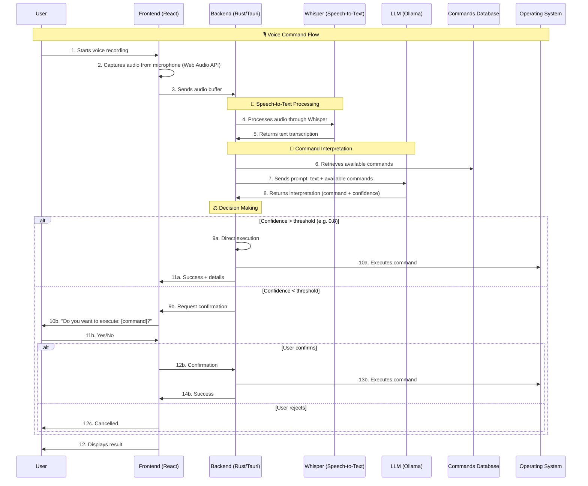

# Voice Command Processing Flow

## Overview

This document describes the complete end-to-end flow for processing voice commands in ShortcutArtisan. The system enables users to execute custom keyboard shortcuts using natural language voice commands, providing an intuitive and hands-free way to interact with the application.

## Architecture Components

### Frontend (React/Next.js)

- **Voice Capture**: Web Audio API integration for microphone input
- **User Interface**: Recording indicators, confirmation dialogs, status feedback
- **State Management**: Redux Toolkit for voice command state

### Backend (Rust/Tauri)

- **Audio Processing**: Coordination between voice capture and speech-to-text
- **Command Interpretation**: Integration with LLM for natural language understanding
- **Execution Engine**: Decision making and command execution logic
- **Database Integration**: Access to shortcuts and commands database

### AI Services

- **Whisper (Speech-to-Text)**: Local speech recognition using candle-whisper
- **Ollama (LLM)**: Local Llama 3.2:3b model for command interpretation
- **Docker**: Containerized AI services for consistent deployment

## Complete Flow Diagram

## Detailed Process Steps

### Phase 1: Voice Capture

1. **User Activation**: User clicks voice command button or uses hotkey
2. **Microphone Access**: Frontend requests microphone permissions
3. **Audio Recording**: Web Audio API captures audio stream
4. **Buffer Creation**: Audio data converted to transferable buffer format
5. **Data Transmission**: Audio buffer sent to Tauri backend

### Phase 2: Speech Recognition

1. **Audio Reception**: Backend receives audio buffer from frontend
2. **Whisper Processing**: Audio processed through local Whisper model
3. **Transcription**: Speech converted to text with confidence scores
4. **Text Validation**: Basic validation and noise filtering
5. **Result Return**: Clean text transcription returned

### Phase 3: Command Interpretation

1. **Context Gathering**: System retrieves all available shortcuts from database
2. **Prompt Construction**: Creates structured prompt with:
   - User's transcribed text
   - Available commands and their descriptions
   - Context about command categories
3. **LLM Processing**: Ollama processes the prompt using Llama 3.2:3b
4. **Response Parsing**: LLM response parsed for:
   - Best matching command ID
   - Confidence score (0.0-1.0)
   - Reasoning explanation
   - Alternative suggestions

### Phase 4: Decision Making & Execution

1. **Confidence Evaluation**: System evaluates LLM confidence score
2. **Decision Tree**:
   - **High Confidence (≥0.8)**: Immediate execution
   - **Medium Confidence (0.6-0.79)**: Request user confirmation
   - **Low Confidence (<0.6)**: Show alternatives or error message
3. **Command Execution**: If approved, execute through existing shortcut system
4. **Feedback**: Provide user feedback on execution result
